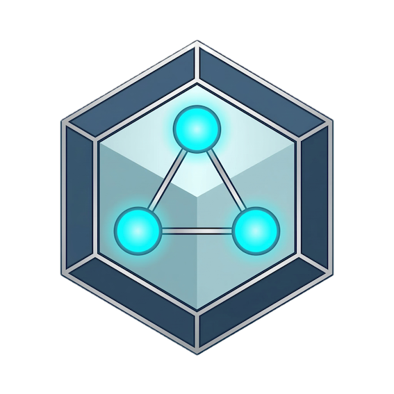

<p align="center">
  
</p>


# Gno

[](https://hex.pm/packages/gno)
[](https://hexdocs.pm/gno/)
[](https://github.com/rdf-elixir/gno/blob/main/LICENSE.md)

[](https://github.com/rdf-elixir/gno/actions/workflows/elixir-build-and-test.yml)
[](https://github.com/rdf-elixir/gno/actions/workflows/elixir-dialyzer.yml)
[](https://github.com/rdf-elixir/gno/actions/workflows/elixir-quality-checks.yml)

> *gnō-*, Proto-Indo-European root meaning "to know."
>
> -- [Etymonline](https://www.etymonline.com/word/*gno-)

Gno is an Elixir library that abstracts RDF dataset persistence across different storage backends, providing a single API for querying, updating, and managing RDF data regardless of the underlying SPARQL triple store. It uses [DCAT-R](https://w3id.org/dcatr) for its structural model and RDF-based configuration.


## Features

- **Unified SPARQL API** — query (`SELECT`, `ASK`, `CONSTRUCT`, `DESCRIBE`), update, and manage graphs through a single interface
- **Multiple store backends** — built-in adapters for Apache Jena Fuseki, Oxigraph, QLever, and Ontotext GraphDB, with a generic adapter for any SPARQL 1.1-compatible store
- **RDF-based configuration** — services, repositories, and stores are described in Turtle manifests using DCAT-R vocabulary, with environment-specific configs (dev/test/prod)
- **Changeset system** — structured representation of RDF changes with four actions (add, update, replace, remove) and automatic computation of minimal effective changes
- **Transactional commits** — changes applied atomically with automatic rollback on failure and an extensible middleware pipeline


## Getting Started

### Installation

For complete setup instructions including HTTP adapter configuration, store backend setup, and manifest configuration, see the [Installation guide](https://rdf-elixir.dev/gno-guide/installation).

### Quick Example

```elixir
# Query data
{:ok, result} = Gno.select("SELECT ?s ?p ?o WHERE { ?s ?p ?o }")

# Insert data
:ok = Gno.insert_data(EX.S |> EX.p(EX.O))

# Commit structured changes transactionally
{:ok, commit} = Gno.commit(
  add: EX.S1 |> EX.p(EX.O1),
  update: EX.S2 |> EX.p(EX.O2),
  remove: EX.S3 |> EX.p(EX.O3)
)
```

### Further Reading

**For a comprehensive guide** covering installation, configuration, querying, and data management, see the [User Guide](https://rdf-elixir.dev/gno-guide/).

**For detailed API documentation**, see the [HexDocs documentation](https://hexdocs.pm/gno).


## Consulting

If you need help with your Elixir and Linked Data projects, just contact [NinjaConcept](https://www.ninjaconcept.com/) via <contact@ninjaconcept.com>.


## Acknowledgements

<table style="border: 0;">
<tr>
<td><a href="https://nlnet.nl/"></a></td>
<td><a href="https://nlnet.nl/core" ></a></td>
<td><a href="https://jb.gg/OpenSource"></a></td>
</tr>
</table>

This project is funded through [NGI Zero Core](https://nlnet.nl/core), a fund established by [NLnet](https://nlnet.nl/) with financial support from the European Commission's [Next Generation Internet](https://ngi.eu/) program.

[JetBrains](https://jb.gg/OpenSource) supports the project with complimentary access to its development environments.


## License and Copyright

(c) 2026 Marcel Otto. MIT Licensed, see [LICENSE](LICENSE.md) for details.

